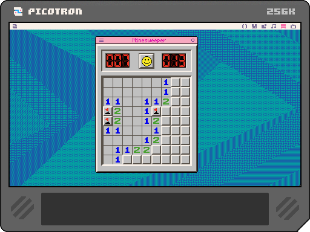

# 🧨 Minesweeper for Picotron

A near **pixel-perfect clone** of the classic **Windows 98 Minesweeper**, built for **Picotron Fantasy Workstation**. **[LIVE DEMO](https://www.lexaloffle.com/bbs/widget.php?pid=minesweep)**

---

## 🎯 Features

- Faithful recreation of the Win98 Minesweeper experience
- Accurate UI and layout down to pixel alignment
- Responsive mouse-based controls
- Classic grid sizes and mine counts

---

## 🖱️ Controls

- **Left Click**: Reveal a tile  
- **Right Click**: Flag or unflag a tile  
- **Both Clicks** (on a revealed number): Quick reveal neighbors (if flagged correctly)

---

## 🛠 Requirements

- [**Picotron**](https://www.lexaloffle.com/picotron.php) installed  
- Mouse required

---

## 🚀 How to Play

1. Open **Picotron**
2. Load the cart:  
   - Place `minesweeper.p64` in your Picotron carts directory
   - Or drag it into Picotron
3. Launch the cart and enjoy the nostalgia
